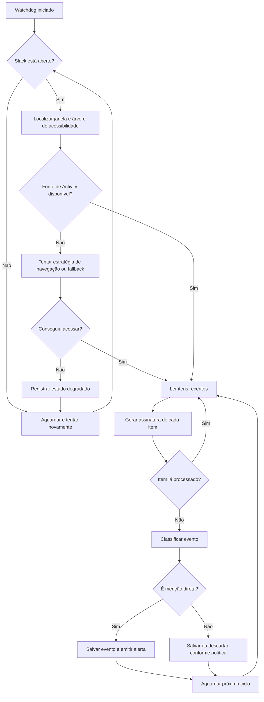
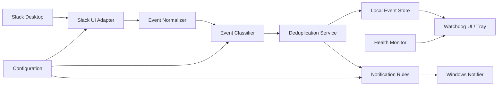

# AlwaysTrack Watchdog — Documento Central do Projeto

> **Status:** Planejamento inicial  
> **Versão:** 0.1  
> **Data:** 22/07/2026  
> **Responsável inicial:** Ivanilson Ferreira  
> **Tipo de projeto:** Aplicação local para Windows, inicialmente independente, preparada para futura integração ao AlwaysTrack

---

## 1. Propósito deste documento

Este arquivo é a **fonte central de verdade** do AlwaysTrack Watchdog durante a fase inicial do projeto.

Ele existe para:

- registrar claramente o problema que será resolvido;
- definir o escopo do MVP;
- evitar que o projeto cresça antes de provar sua viabilidade;
- orientar decisões de arquitetura sem amarrar o projeto a uma tecnologia específica;
- preparar o software para futura absorção pelo AlwaysTrack;
- servir de referência para o pipeline de implementação, testes e documentação;
- concentrar riscos, limitações, decisões e critérios de aceite.

Sempre que uma decisão importante mudar, este documento deve ser atualizado antes ou junto da implementação.

---

## 2. Visão do produto

O **AlwaysTrack Watchdog** será um agente local que acompanha notificações recebidas no Slack Desktop e gera um alerta próprio quando identificar uma **menção direta ao usuário**, ignorando o ruído causado por menções a grupos como `@sac`, `@backoffice` e `@devs`.

A primeira versão será uma aplicação separada do AlwaysTrack, porém construída desde o início com:

- domínio desacoplado;
- contratos claros;
- configuração isolada;
- persistência independente;
- eventos padronizados;
- possibilidade de execução como serviço ou agente em segundo plano;
- integração futura por API local, biblioteca compartilhada ou módulo interno.

### Resultado esperado

O usuário não deve precisar acompanhar continuamente a aba de Activity do Slack para descobrir se foi mencionado diretamente.

O Watchdog deverá:

1. permanecer ativo em segundo plano;
2. observar o Slack Desktop;
3. identificar novos itens de atividade;
4. diferenciar menções diretas de menções a grupos;
5. ignorar itens já processados;
6. emitir um alerta destacado apenas para eventos relevantes;
7. guardar um histórico mínimo para conferência.

---

## 3. Problema

O Slack gera um grande volume de notificações porque o usuário participa de grupos frequentemente mencionados, especialmente o grupo `@sac`.

Na prática:

- a maioria absoluta das notificações não exige ação individual;
- menções diretas importantes ficam misturadas com centenas de menções coletivas;
- a aba de Activity perde utilidade por excesso de ruído;
- o usuário pode deixar de responder uma solicitação realmente direcionada a ele;
- desativar completamente as notificações do grupo pode não ser permitido, desejável ou suficiente;
- depender de inspeção manual contínua aumenta desgaste e risco operacional.

### Problema central

> Como detectar de forma confiável que o usuário foi mencionado diretamente no Slack Desktop, sem depender de privilégios administrativos no workspace e sem obrigá-lo a verificar manualmente a Activity o dia inteiro?

---

## 4. Objetivo principal

Criar uma aplicação local para Windows que gere alerta próprio quando surgir uma nova **menção direta ao usuário no Slack**, ignorando menções originadas por grupos.

### Objetivos secundários

- reduzir drasticamente o ruído percebido;
- evitar perda de mensagens relevantes;
- registrar as menções diretas detectadas;
- permitir operação silenciosa em segundo plano;
- manter consumo de recursos baixo;
- permitir evolução futura para outras fontes de eventos;
- viabilizar integração posterior ao AlwaysTrack sem reescrever o núcleo.

---

## 5. Não objetivos do MVP

O MVP não terá como objetivo:

- substituir o Slack;
- ler todas as mensagens de todos os canais;
- responder mensagens automaticamente;
- enviar mensagens pelo usuário;
- instalar um app oficial no workspace;
- utilizar credenciais, cookies ou tokens do Slack diretamente;
- interceptar tráfego criptografado;
- injetar código no processo do Slack;
- alterar comportamento interno do cliente Slack;
- criar um sistema completo de produtividade;
- monitorar Outlook, Teams, WhatsApp, Jira ou AlwaysChat;
- classificar urgência por inteligência artificial;
- garantir compatibilidade com qualquer versão futura do Slack sem manutenção;
- operar em outros sistemas além do Windows na primeira versão.

Esses itens podem ser discutidos futuramente, mas não devem entrar no primeiro ciclo de implementação.

---

## 6. Estratégia técnica inicial

### 6.1 Abordagem recomendada para o MVP

A primeira abordagem será baseada em **Windows UI Automation**, utilizando a árvore de acessibilidade exposta pelo Slack Desktop.

O Watchdog observará elementos da interface do Slack e tentará extrair informações suficientes para classificar cada item como:

- menção direta;
- menção a grupo;
- reação;
- resposta em thread;
- mensagem direta;
- evento desconhecido.

A classificação inicial pode utilizar os rótulos apresentados pelo próprio Slack, por exemplo:

- `Menção na conversa do canal`;
- `Menção ao grupo na conversa do canal`.

O texto exato deverá ser confirmado durante o spike de viabilidade, pois pode variar conforme:

- idioma do Slack;
- versão do aplicativo;
- tipo de atividade;
- atualização da interface;
- contexto do canal.

### 6.2 Por que não começar por API oficial

A API oficial pode exigir:

- criação de aplicativo Slack;
- instalação no workspace;
- permissões administrativas;
- escopos de leitura;
- aprovação interna da empresa;
- tratamento seguro de tokens.

Além disso, o objetivo inicial é monitorar a experiência já exibida ao usuário, sem depender de integração administrativa.

A API oficial permanece como alternativa futura caso haja autorização e vantagens claras.

### 6.3 Abordagens descartadas no início

#### OCR de tela

Será considerado apenas como fallback, pois tende a ser mais frágil em relação a:

- resolução;
- escala do Windows;
- tema claro ou escuro;
- posição da janela;
- fontes;
- animações;
- sobreposição de janelas;
- custo de processamento.

#### Interceptação de WebSocket ou tráfego interno

Não será utilizada no MVP devido a:

- maior risco técnico;
- potencial conflito com políticas corporativas;
- dependência de detalhes internos não documentados;
- possibilidade de quebra frequente;
- necessidade de lidar com autenticação e segurança de forma mais invasiva.

#### Leitura direta de banco local, cache ou IndexedDB

Não será a primeira opção porque:

- a estrutura interna do Slack pode mudar;
- dados podem estar fragmentados ou criptografados;
- pode haver impacto de integridade ou privacidade;
- a relação entre cache e notificações úteis pode não ser direta.

---

## 7. Hipótese central de viabilidade

O projeto parte da seguinte hipótese:

> O Slack Desktop expõe, por meio da árvore de acessibilidade do Windows, informação suficiente para diferenciar um item de menção direta de um item de menção a grupo.

Essa hipótese deve ser provada antes de construir o restante do sistema.

### Spike obrigatório

O primeiro entregável técnico deve ser um pequeno experimento capaz de:

1. localizar a janela do Slack;
2. inspecionar a árvore de acessibilidade;
3. encontrar os itens da Activity;
4. extrair o tipo do evento;
5. extrair parte do conteúdo;
6. detectar pelo menos um item de menção direta;
7. distinguir esse item de uma menção ao grupo `@sac`;
8. verificar o comportamento com o Slack em diferentes estados:
   - aberto em primeiro plano;
   - aberto em segundo plano;
   - minimizado;
   - Activity fechada;
   - janela em outro canal.

### Resultado esperado do spike

Ao final, uma das conclusões deve ser registrada:

- **Viável sem abrir Activity manualmente**;
- **Viável, mas requer Activity aberta**;
- **Viável apenas com automação de navegação até Activity**;
- **UI Automation insuficiente; necessário fallback**;
- **Inviável com restrições atuais**.

Não deve ser assumido antecipadamente que o Slack minimizado continuará expondo todos os elementos necessários.

---

## 8. Escopo funcional do MVP

### 8.1 Monitoramento

O sistema deverá:

- localizar o processo e a janela do Slack Desktop;
- identificar se o Slack está aberto;
- aguardar caso o Slack esteja fechado;
- iniciar ou retomar o monitoramento automaticamente;
- verificar periodicamente a presença de novos itens;
- evitar processamento duplicado;
- continuar funcionando após perda temporária da janela;
- registrar falhas sem interromper silenciosamente.

### 8.2 Classificação de eventos

O MVP deve classificar, no mínimo:

| Tipo | Ação |
|---|---|
| Menção direta ao usuário | Alertar |
| Menção a grupo | Ignorar |
| Evento já processado | Ignorar |
| Evento desconhecido | Registrar sem alertar |
| Falha de leitura | Registrar e tentar novamente |

Opcionalmente, poderá reconhecer mensagens diretas, mas isso não é obrigatório para a primeira entrega.

### 8.3 Alertas

Ao detectar uma nova menção direta, o Watchdog deverá emitir pelo menos:

- notificação nativa do Windows;
- som diferente do Slack;
- indicação de remetente, canal e trecho da mensagem, quando disponíveis.

O alerta deve ser:

- claro;
- difícil de confundir com o Slack;
- emitido apenas uma vez por item;
- persistente o suficiente para ser percebido;
- configurável no futuro.

### 8.4 Histórico

O sistema deverá armazenar um histórico mínimo contendo:

- identificador local do evento;
- data e hora da detecção;
- tipo do evento;
- remetente, quando disponível;
- canal ou conversa, quando disponível;
- trecho do conteúdo;
- status de alerta;
- assinatura usada para deduplicação;
- data e hora de processamento;
- versão do classificador.

### 8.5 Execução em segundo plano

O Watchdog deverá:

- iniciar manualmente no começo do MVP;
- posteriormente oferecer inicialização com o Windows;
- permanecer na bandeja do sistema;
- possuir comandos básicos:
  - abrir painel;
  - pausar monitoramento;
  - retomar monitoramento;
  - encerrar;
  - visualizar status.

---

## 9. Fluxo operacional esperado



---

## 10. Arquitetura proposta

A implementação deve separar claramente as responsabilidades.



### 10.1 Componentes

#### A. Slack UI Adapter

Responsável por interagir exclusivamente com a interface do Slack.

Funções:

- localizar janela e processo;
- inspecionar a árvore de acessibilidade;
- navegar até a área necessária, caso permitido;
- extrair elementos brutos;
- converter controles visuais em um modelo intermediário;
- detectar mudanças de estrutura;
- expor erros de integração sem derrubar o restante do sistema.

Este componente deve ser substituível. O restante do sistema não deve depender diretamente de detalhes de UI Automation.

#### B. Event Normalizer

Transforma dados brutos em um evento padronizado.

Exemplo conceitual:

```text
ObservedEvent
- source
- external_key
- raw_type
- title
- sender
- channel
- body
- observed_at
- raw_metadata
```

#### C. Event Classifier

Determina o tipo semântico do evento.

Saídas possíveis:

- `DIRECT_MENTION`;
- `GROUP_MENTION`;
- `DIRECT_MESSAGE`;
- `THREAD_REPLY`;
- `REACTION`;
- `UNKNOWN`.

A primeira versão pode usar regras determinísticas baseadas em:

- nome acessível do controle;
- texto do rótulo;
- posição e hierarquia do elemento;
- padrões conhecidos do Slack em português;
- presença de termos configurados.

#### D. Deduplication Service

Impede que o mesmo item gere vários alertas.

A assinatura pode combinar:

- tipo;
- remetente;
- canal;
- trecho da mensagem;
- horário aproximado;
- identificador acessível, quando houver.

O algoritmo deve tolerar pequenas mudanças visuais sem gerar duplicatas em excesso.

#### E. Notification Rules

Decide se um evento deve gerar alerta.

Regra inicial:

```text
DIRECT_MENTION => alertar
GROUP_MENTION => ignorar
UNKNOWN => não alertar e registrar
```

#### F. Windows Notifier

Responsável por:

- emitir notificação nativa;
- tocar som;
- evitar alertas repetidos;
- opcionalmente abrir ou focar o Slack ao clicar.

#### G. Local Event Store

Persiste:

- eventos detectados;
- itens processados;
- falhas;
- configurações;
- versão de esquema;
- estado do monitoramento.

Para o MVP, SQLite é uma opção adequada, mas a decisão final pertence ao pipeline de implementação.

#### H. Tray/UI

Interface mínima para:

- mostrar estado;
- pausar e retomar;
- verificar última leitura;
- abrir histórico;
- acessar logs;
- alterar preferências básicas.

#### I. Health Monitor

Indica se o sistema está realmente funcional.

Estados sugeridos:

- `STARTING`;
- `MONITORING`;
- `SLACK_NOT_RUNNING`;
- `SLACK_NOT_ACCESSIBLE`;
- `ACTIVITY_NOT_FOUND`;
- `DEGRADED`;
- `PAUSED`;
- `ERROR`.

---

## 11. Preparação para integração futura ao AlwaysTrack

Mesmo separado, o Watchdog deve evitar dependências rígidas da interface atual.

### 11.1 Princípios

- o núcleo não deve depender da UI do Watchdog;
- o adaptador do Slack deve ser isolado;
- o modelo de eventos deve ser genérico;
- configurações devem ser serializáveis;
- armazenamento deve possuir versão de esquema;
- notificações devem ser acionadas por eventos internos;
- o processo deve poder expor status por API local futuramente;
- nenhuma regra deve depender diretamente de uma página específica do AlwaysTrack.

### 11.2 Opções futuras de absorção

#### Opção A — Processo independente integrado por API local

O Watchdog continua como agente separado e o AlwaysTrack consulta:

- status;
- histórico;
- configurações;
- eventos recentes.

Vantagens:

- melhor isolamento;
- menor risco de derrubar o AlwaysTrack;
- evolução independente;
- fácil reinício do agente.

#### Opção B — Biblioteca compartilhada

O núcleo é convertido em biblioteca e incorporado ao backend ou desktop companion do AlwaysTrack.

Vantagens:

- reutilização direta;
- menos processos;
- configuração centralizada.

Risco:

- maior acoplamento com o ciclo de vida do AlwaysTrack.

#### Opção C — Serviço local comum

O Watchdog vira parte de um serviço local do AlwaysTrack responsável por integrações, automações e SmartScript.

Essa pode ser a arquitetura final mais coerente, mas não deve ser antecipada antes da validação do MVP.

### 11.3 Contrato de evento recomendado

O projeto deve adotar um envelope genérico desde o início:

```text
OperationalEvent
- id
- source
- category
- priority
- title
- body
- actor
- location
- occurred_at
- observed_at
- deduplication_key
- metadata
- schema_version
```

Isso permite que, futuramente, o mesmo mecanismo aceite:

- Slack;
- AlwaysChat;
- Outlook;
- Teams;
- GitHub;
- Jira;
- outros sistemas internos.

---

## 12. Estrutura sugerida do repositório

A estrutura abaixo é conceitual e pode ser adaptada à stack escolhida.

```text
always-track-watchdog/
├── README.md
├── docs/
│   ├── MASTER_SPEC.md
│   ├── architecture/
│   │   ├── decisions/
│   │   └── diagrams/
│   ├── research/
│   │   └── slack-ui-automation-spike.md
│   ├── operations/
│   │   ├── troubleshooting.md
│   │   └── privacy-and-security.md
│   └── testing/
│       └── test-strategy.md
├── src/
│   ├── core/
│   ├── adapters/
│   │   └── slack_ui/
│   ├── classification/
│   ├── persistence/
│   ├── notifications/
│   ├── application/
│   └── ui/
├── tests/
│   ├── unit/
│   ├── integration/
│   ├── fixtures/
│   └── manual/
├── scripts/
├── assets/
├── config/
├── .github/
│   └── workflows/
└── packaging/
```

### Arquivos iniciais recomendados

- `README.md`: visão rápida e instruções de execução;
- `docs/MASTER_SPEC.md`: cópia deste documento;
- `docs/research/slack-ui-automation-spike.md`: resultados do primeiro experimento;
- `docs/architecture/decisions/ADR-0001-use-ui-automation.md`;
- `docs/architecture/decisions/ADR-0002-standalone-first.md`;
- `docs/operations/privacy-and-security.md`;
- `docs/testing/test-strategy.md`.

---

## 13. Configuração inicial prevista

Configurações mínimas:

```text
watchdog.enabled
watchdog.poll_interval_ms
watchdog.start_with_windows
slack.process_names
slack.language
slack.direct_mention_labels
slack.group_mention_labels
slack.user_display_names
notification.enabled
notification.sound_enabled
notification.sound_file
notification.persist_history
storage.path
logging.level
```

### Valores importantes

O sistema não deve depender apenas do texto `@ivan`, pois a Activity pode identificar o tipo do evento sem repetir literalmente a menção.

A configuração do usuário pode conter:

- nome exibido;
- apelido;
- nomes alternativos;
- idioma da interface;
- rótulos conhecidos de menção direta;
- rótulos conhecidos de menção a grupo.

---

## 14. Persistência e deduplicação

### 14.1 Necessidade

Sem persistência, o sistema pode alertar novamente sobre todos os itens visíveis ao reiniciar.

### 14.2 Dados mínimos

Tabela ou coleção de eventos:

```text
id
source
external_key
classification
sender
channel
content_preview
observed_at
first_seen_at
last_seen_at
alerted_at
status
classifier_version
deduplication_key
raw_fingerprint
```

Tabela ou coleção de estado:

```text
last_successful_scan_at
last_error_at
last_error_code
slack_version
adapter_version
schema_version
```

### 14.3 Política de retenção

Sugestão inicial:

- manter eventos relevantes por 30 dias;
- manter eventos ignorados por período curto ou apenas sua assinatura;
- permitir limpeza manual;
- não armazenar mensagens completas sem necessidade;
- armazenar somente trecho mínimo para identificação.

---

## 15. Privacidade, segurança e uso responsável

O Watchdog processará conteúdo potencialmente corporativo. Portanto:

- os dados devem permanecer localmente por padrão;
- não deve haver telemetria externa sem consentimento explícito;
- não devem ser capturados tokens ou credenciais do Slack;
- logs não devem registrar mensagens completas por padrão;
- o histórico deve armazenar apenas o necessário;
- arquivos locais devem ficar em diretório do usuário;
- configurações sensíveis não devem ser commitadas;
- dumps de UI e screenshots de depuração devem ser tratados como dados sensíveis;
- o repositório não deve conter conversas reais;
- fixtures de teste devem ser anonimizadas;
- o usuário deve verificar se o uso está de acordo com políticas internas da empresa.

### Diretório local sugerido

```text
%LOCALAPPDATA%\AlwaysTrack\Watchdog\
```

Conteúdo possível:

```text
config.json
watchdog.db
logs\
cache\
```

---

## 16. Observabilidade e diagnóstico

O sistema deve ser capaz de explicar por que não alertou.

### Logs essenciais

- aplicação iniciada;
- versão do sistema;
- Slack localizado;
- versão do Slack, quando disponível;
- árvore acessível encontrada;
- Activity encontrada ou não;
- quantidade de itens lidos;
- quantidade de itens novos;
- classificação de cada item sem conteúdo sensível excessivo;
- evento descartado por duplicidade;
- alerta emitido;
- erro de automação;
- alteração de estrutura detectada;
- retomada após falha.

### Painel de diagnóstico mínimo

O painel deve mostrar:

```text
Status: Monitorando
Slack: Detectado
Última leitura bem-sucedida: 15:42:08
Itens lidos no último ciclo: 18
Novos itens: 1
Menções diretas hoje: 2
Último erro: Nenhum
```

### Modo de diagnóstico

Deve existir um modo opcional que permita:

- exportar árvore de acessibilidade anonimizada;
- registrar nomes e tipos dos controles;
- capturar métricas de tempo;
- comparar estrutura antes e depois de atualizações do Slack.

---

## 17. Estratégia de testes

### 17.1 Testes unitários

Cobrir:

- classificação de rótulos;
- normalização de texto;
- deduplicação;
- regras de alerta;
- serialização;
- retenção de histórico;
- mudanças de idioma configuradas.

### 17.2 Testes de integração

Cobrir:

- adaptador com fixtures da árvore de acessibilidade;
- persistência real;
- emissão de notificação;
- recuperação após falha;
- mudança de janela do Slack;
- reinício da aplicação.

### 17.3 Testes manuais obrigatórios

| Cenário | Resultado esperado |
|---|---|
| Alguém menciona `@ivan` em canal | Um alerta |
| Alguém menciona `@sac` | Nenhum alerta |
| Mesma menção permanece visível | Não alertar novamente |
| Watchdog reinicia | Não repetir itens antigos |
| Slack fechado | Estado de espera, sem falhar |
| Slack abre depois | Monitoramento retoma |
| Slack minimizado | Validar comportamento real |
| Activity fechada | Validar estratégia definida pelo spike |
| Slack atualizado | Detectar possível quebra e registrar erro |
| Tema claro/escuro | Sem diferença funcional |
| Escala do Windows diferente | Sem diferença funcional, se UI Automation funcionar corretamente |

### 17.4 Teste de confiabilidade

Executar o Watchdog durante um expediente completo e comparar:

- menções diretas reais;
- menções detectadas;
- falsos positivos;
- falsos negativos;
- duplicatas;
- tempo médio entre evento e alerta;
- consumo de CPU e memória.

---

## 18. Critérios de aceite do MVP

O MVP será considerado aceito quando:

1. detectar uma nova menção direta ao usuário;
2. ignorar uma menção ao grupo `@sac`;
3. não alertar duas vezes para o mesmo evento;
4. operar em segundo plano durante pelo menos quatro horas sem intervenção;
5. recuperar-se após o Slack ser fechado e aberto novamente;
6. armazenar histórico mínimo de eventos diretos;
7. apresentar estado de saúde do monitoramento;
8. registrar erro quando não conseguir acessar a interface;
9. não exigir privilégios administrativos no workspace para funcionar tecnicamente;
10. não capturar token, senha ou cookie do Slack;
11. possuir documentação de instalação e troubleshooting;
12. apresentar taxa de detecção adequada no teste de campo.

### Meta de qualidade inicial

Durante o piloto:

- falsos negativos: idealmente zero;
- falsos positivos: próximos de zero;
- duplicatas: zero após estabilização;
- latência de alerta: até 10 segundos, dependendo do intervalo de monitoramento;
- consumo de CPU em repouso: baixo;
- consumo de memória: compatível com agente leve.

Não deve ser prometida confiabilidade absoluta antes do piloto real.

---

## 19. Fases de implementação

### Fase 0 — Setup

- criar repositório;
- definir stack;
- configurar lint, testes e build;
- copiar este documento para `docs/MASTER_SPEC.md`;
- criar README inicial;
- configurar versionamento e releases;
- registrar decisões arquiteturais.

### Fase 1 — Spike de UI Automation

- localizar Slack;
- inspecionar árvore;
- encontrar Activity;
- capturar eventos;
- testar estados da janela;
- documentar resultados;
- decidir estratégia definitiva do MVP.

### Fase 2 — Núcleo funcional

- modelo de evento;
- normalizador;
- classificador;
- deduplicação;
- persistência;
- regras de alerta.

### Fase 3 — Integração Windows

- notificação nativa;
- som;
- bandeja;
- status;
- execução em segundo plano;
- recuperação de falhas.

### Fase 4 — Piloto real

- uso durante expediente;
- comparação manual;
- ajuste de regras;
- métricas de falso positivo e negativo;
- documentação de limitações.

### Fase 5 — Empacotamento

- instalador ou executável distribuível;
- inicialização com Windows;
- configuração persistente;
- atualização controlada;
- logs acessíveis.

### Fase 6 — Preparação para AlwaysTrack

- estabilizar contrato de eventos;
- avaliar API local;
- separar core em biblioteca;
- documentar pontos de integração;
- decidir entre processo independente, serviço local ou incorporação direta.

---

## 20. Backlog inicial priorizado

### P0 — Obrigatório

- [ ] Criar spike de inspeção da árvore do Slack.
- [ ] Identificar menção direta.
- [ ] Identificar menção a grupo.
- [ ] Documentar comportamento com Slack minimizado.
- [ ] Implementar modelo de eventos.
- [ ] Implementar classificador inicial.
- [ ] Implementar deduplicação.
- [ ] Emitir alerta do Windows.
- [ ] Persistir eventos processados.
- [ ] Exibir status mínimo.

### P1 — Importante

- [ ] Rodar na bandeja.
- [ ] Iniciar com Windows.
- [ ] Adicionar som configurável.
- [ ] Exibir histórico.
- [ ] Permitir pausar e retomar.
- [ ] Adicionar logs estruturados.
- [ ] Implementar retenção automática.

### P2 — Evolução

- [ ] Abrir item correspondente no Slack.
- [ ] Marcar menção como vista no Watchdog.
- [ ] Filtros adicionais.
- [ ] Mensagens diretas.
- [ ] API local para AlwaysTrack.
- [ ] Painel no AlwaysTrack.
- [ ] Outras fontes de evento.

---

## 21. Riscos principais

### Risco 1 — Slack não expõe dados suficientes

**Impacto:** alto.  
**Mitigação:** spike antes do desenvolvimento completo; avaliar navegação automatizada, notificações do Windows ou fallback controlado.

### Risco 2 — Elementos desaparecem quando minimizado

**Impacto:** alto.  
**Mitigação:** testar estados reais; considerar janela em segundo plano, workspace auxiliar ou mecanismo alternativo.

### Risco 3 — Atualização do Slack quebra seletores

**Impacto:** médio/alto.  
**Mitigação:** seletores semânticos; adapter isolado; testes com fixtures; diagnóstico claro; versionamento do adapter.

### Risco 4 — Falsos negativos

**Impacto:** alto.  
**Mitigação:** priorizar segurança; registrar eventos desconhecidos; alertar opcionalmente em modo conservador durante piloto.

### Risco 5 — Duplicatas

**Impacto:** médio.  
**Mitigação:** assinatura persistente; janela temporal; testes de reinício.

### Risco 6 — Política corporativa

**Impacto:** variável.  
**Mitigação:** processamento local; sem credenciais; sem interceptação de tráfego; confirmar conformidade interna antes de uso definitivo.

### Risco 7 — Consumo excessivo

**Impacto:** baixo/médio.  
**Mitigação:** intervalo configurável; event-driven quando possível; métricas de CPU e memória.

### Risco 8 — Idioma ou rótulos mudam

**Impacto:** médio.  
**Mitigação:** configuração externa; classificador versionado; regras por idioma; modo de diagnóstico.

---

## 22. Decisões iniciais registradas

### Decisão 001 — Projeto independente primeiro

O Watchdog será desenvolvido em repositório próprio para reduzir risco, acelerar experimentação e evitar impacto no AlwaysTrack.

### Decisão 002 — Preparado para integração

O núcleo será desacoplado da interface e o modelo de eventos será genérico.

### Decisão 003 — UI Automation como primeira tentativa

A primeira investigação usará a árvore de acessibilidade do Windows, sem interceptar tráfego ou acessar credenciais.

### Decisão 004 — Provar viabilidade antes do produto

Nenhuma interface completa ou integração com AlwaysTrack deve ser construída antes do spike comprovar a detecção confiável.

### Decisão 005 — Local-first

Dados, histórico e logs permanecerão localmente por padrão.

### Decisão 006 — Menção direta é o único gatilho obrigatório

O MVP existe para separar `@ivan` de `@sac`. Outros eventos são secundários.

---

## 23. Questões em aberto

Estas perguntas devem ser respondidas durante o setup e o spike:

1. Qual stack será usada?
2. O Watchdog será um executável nativo, aplicativo desktop ou serviço com UI separada?
3. A árvore de acessibilidade do Slack expõe os cartões da Activity?
4. O Slack precisa estar com a Activity aberta?
5. É possível navegar até Activity sem interferir no trabalho?
6. O Slack minimizado mantém elementos acessíveis?
7. Existe identificador estável por item?
8. Qual será a estratégia final de deduplicação?
9. O clique na notificação conseguirá abrir o item correto?
10. Qual formato de configuração será adotado?
11. Qual banco local será utilizado?
12. Qual biblioteca de notificações Windows será adotada?
13. O agente terá atualização automática ou manual?
14. Como o AlwaysTrack consultará o Watchdog futuramente?
15. Qual política interna se aplica ao uso em máquina corporativa?

---

## 24. Definition of Done por entrega

Uma tarefa só será considerada concluída quando:

- o código estiver implementado;
- os testes aplicáveis estiverem passando;
- a decisão ou comportamento estiver documentado;
- logs e erros estiverem tratados;
- nenhuma informação sensível estiver exposta;
- o comportamento tiver sido validado em ambiente real quando depender do Slack;
- o README ou documento central tiver sido atualizado quando necessário.

---

## 25. Primeira sessão de trabalho recomendada

Depois do setup do repositório, o primeiro ciclo deve ser estritamente investigativo:

1. abrir o Slack Desktop;
2. abrir a Activity em Mentions;
3. usar uma ferramenta de inspeção de UI Automation;
4. localizar os controles que representam os cartões;
5. registrar:
   - tipo do controle;
   - nome acessível;
   - automation id;
   - hierarquia;
   - conteúdo exposto;
6. comparar um cartão de `@ivan` e um de `@sac`;
7. repetir com:
   - Slack em foco;
   - Slack sem foco;
   - Slack minimizado;
   - Activity fechada;
8. salvar o resultado em `docs/research/slack-ui-automation-spike.md`;
9. somente então criar a implementação definitiva do adapter.

### Entregável da primeira sessão

Um relatório simples contendo:

```text
Hipótese: confirmada / parcialmente confirmada / rejeitada
Activity precisa estar aberta: sim / não / incerto
Slack minimizado funciona: sim / não / parcial
Campo que diferencia menção direta: ______
Campo que diferencia grupo: ______
Identificador estável disponível: sim / não
Próxima abordagem recomendada: ______
```

---

## 26. Resumo executivo

O AlwaysTrack Watchdog começará como um agente local independente para Windows. Seu único objetivo obrigatório no MVP é detectar menções diretas no Slack e ignorar menções coletivas, especialmente `@sac`.

A arquitetura será modular, com um adaptador isolado para o Slack, núcleo genérico de eventos, classificação, deduplicação, persistência e alertas. A primeira etapa será um spike de UI Automation para comprovar que a interface do Slack expõe informação suficiente em condições reais.

O projeto não dependerá inicialmente de app oficial do Slack, tokens, administração do workspace ou interceptação de tráfego. A integração com o AlwaysTrack será planejada por contratos e desacoplamento, mas só será executada depois que o MVP estiver estável.

A prioridade é confiabilidade, baixo ruído e operação invisível durante o expediente.

---

## 27. Changelog

### 0.1 — 22/07/2026

- criação do documento central;
- definição do problema e escopo;
- escolha inicial de UI Automation para o spike;
- arquitetura modular preparada para AlwaysTrack;
- backlog, riscos e critérios de aceite iniciais.
